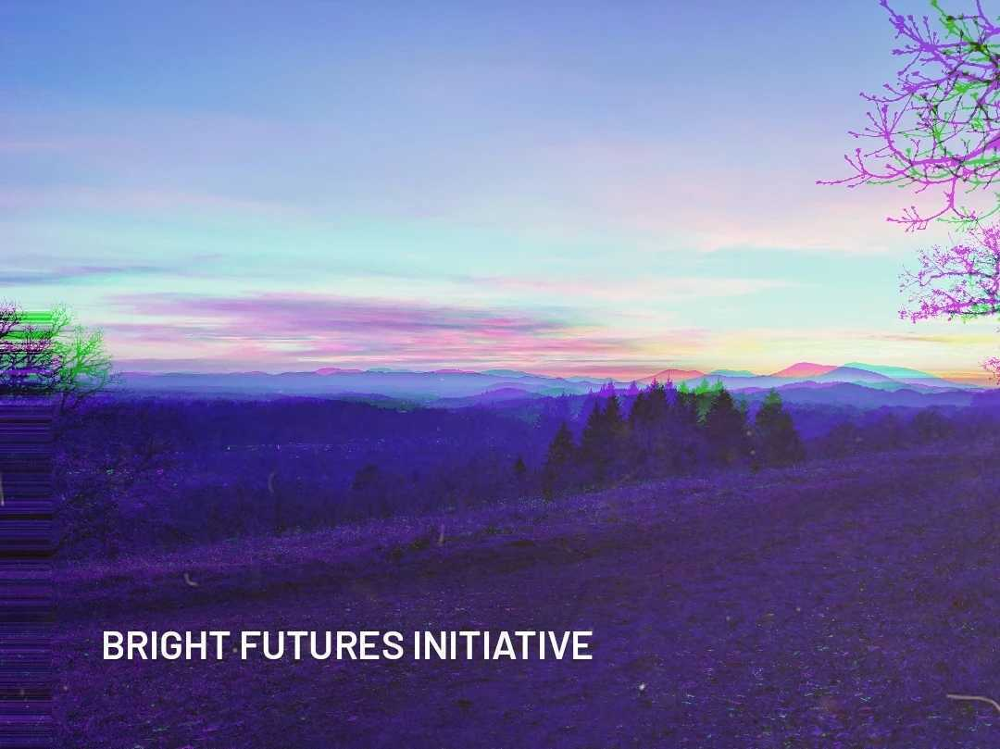

Existential Risks like climate change, General Artificial Intelligence, CRISPR gene-editing technologies, and robotization have the potential to end humanity. In  solving these problems, however, humanity also has the potential to begin a new chapter of unprecedented prosperity. The challenge is that as these risks become more real, people suffer from anxiety, hopelessness, and depression. For example, a recent study showed over half of people ages 16-25 feel “afraid, sad, anxious, angry, powerless, helpless, and/or guilty” about their futures [_1_]. To find solutions to these millennia-defining challenges, we need to stay hopeful and be confident in humanity’s ability to find novel and equitable solutions. We need to fixate all our energies on bright futures where these grand challenges have been solved. 

But what do these bright futures look like? The **Bright Futures Initiative** engages in creating science-informed visions of the future, where humanity’s grand challenges have been solved. We are leading a workshop process by which Oregon scientists, artists, and community members can collaboratively co-design bright futures based on the latest scientific understanding, and represent these futures using various artistic media and forms. 

 

 
 
 
 
 
 
 
 
 
 
_1. Hickman et. al, "Climate anxiety in children and young people and their beliefs about government responses to climate change: a global survey", The Lancet Planetary Health, Volume 5, Issue 12, 2021_ 