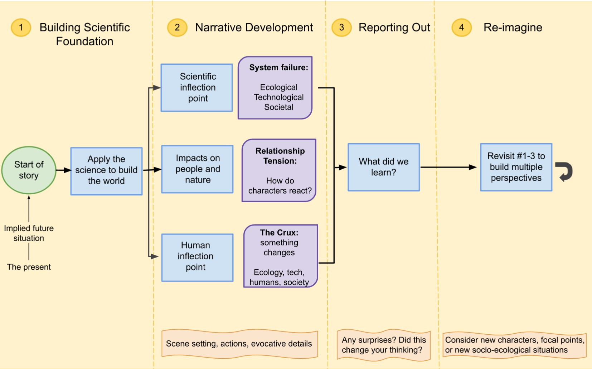

Bright Futures Initiative uses a sci-fi prototyping process to guide workshop participants through a series of questions and reflections to create a narrative and visual representation of a self-identified future scenario. 

Our sci-fi prototyping process draws heavily from the established body of work Andrew Merrie established to devise a set of “four radical futures for global oceans and fisheries”. Two of the scenarios represent more utopian futures, the other two are more dystopian. They are written as speculative fiction in different, engaging narrative styles: a travel magazine article, an obituary, the transcript of a “TED”-like talk, and a series of recovered journal entries,” (Nereus Program 2018). 

Phase 1 - Building Scientific Foundation: In this phase, participants set the scene where the story starts in this implied future. They begin to outline the science involved and build the world the story takes place in. 

Phase 2 - Narrative Development: Participants develop 3 key aspects of the narrative: the Scientific Inflection Point (SIP), the Impacts on People and Nature (IPN), and the Human Inflection Point (HIP). The SIP is the narrative device where the world changes in some significant way. The IPN is the narrative device where ecological, technological, and/or societal problems introduce a tension to the story that the characters must navigate. The HIP illustrates how humanity does not simply react to the changes, but rather interacts with the changes.

Phase 3 - Reporting Out: We ask participants to reflect on the narratives generated and report out what they learned from the process or from the envisioned future scenarios they built. 

Phase 4 - The Good/Bad and Multiple Perspectives: Participants are asked to revisit Phases 1-3 to build multiple versions of their future scenarios showing variations in outcomes, characters, and focal points. The idea is to generate multiple scenarios (the Good and the Bad) that can help participants and readers identify the key actions necessary to move towards and away from these future scenarios. 
 
 
 
 
 

Initially, BFI will leverage AI tools like ChatGPT and the Midjourney Bot to help us get started in writing out a narrative about these future scenarios. Later on when there is more funding and network built, BFI workshops will include creatives of many roles (writers, artists, reporters) who will build out these narratives and visuals in a more involved human-centered approach. 

Workshop Phase 1 - Scenario Building: We ask participants the following questions to get a feel for what experiences and backgrounds are represented in the room. Participants are invited to partner with others and share their answers to the questions. (1) How would you describe yourself?, (2) What perspectives and expertise do you bring to this process?, (3) What three words would you use to describe how you feel about the future state of the world?, (4) In your area of interest or expertise, what is one big problem our world will face? 

Workshop Phase 2 - Narrative Development: There are 3 parts to this narrative development phase.
Part 1: Build scientific foundation and story setting

Part 2: Create ChatGPT Prompt
Part 3: Generate Narrative 

Workshop Phase 3 - Visualization: Participants reduce and revise their narratives and input them into the Midjourney discord server to generate a visual representation of their scenarios. They can do this in an iterative process, each time refining their Midjourney prompt to better reflect the visuals they want. 

Workshop Phase 4 - Reporting Out: Participants respond to a series of questions about what they learned in the process, what the AI tools got right or wrong, and what they would change in a future iteration of the process or workshop. 
