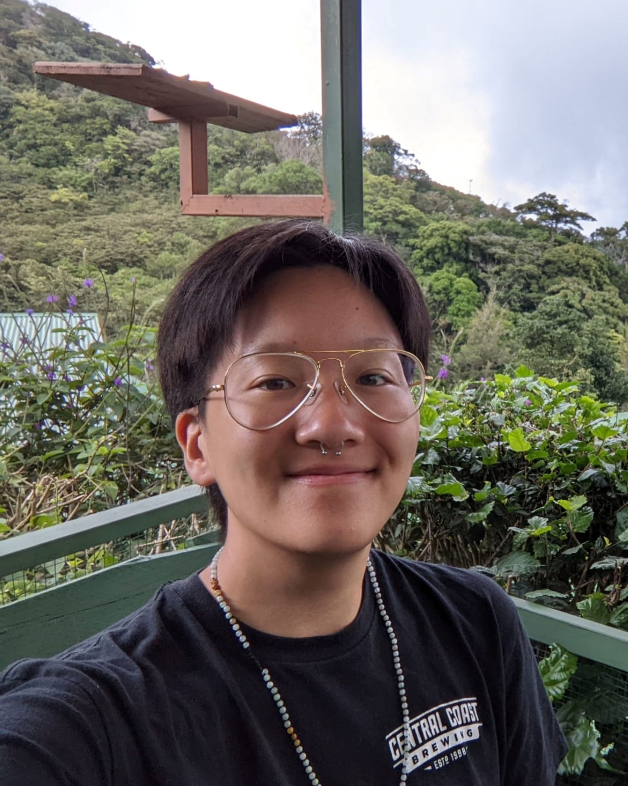

The Bright Futures Initiative was co-founded in 2021 by Dr. James Watson and Val Chang. BFI aims to bring together visionary people across disciplines to envision brighter future scenarios of the worlds we need by collaborating with a wide range of communities across cultural and geographic backgrounds. Interested in collaborating? Contact the BFI team at brightfutures2100@gmail.com

## James Watson

_email:_ james.watson@oregonstate.edu 

James is an Associate Professor leading the Socio-Environmental Analysis Lab at Oregon State University and a co-founder of The Prediction Lab that solves problems using art, data, math and science to create innovative web-based visualizations and tools. James also leads projects with NASA, NOAA, NSF, doing cutting edge environmental research. 

 
 
 
 
 
 
 
 

## Val Tien-Shin Chang

_email:_ changva@oregonstate.edu 

Val is an environmental artist, hydrologist, and co-founder of LUXREN Creative, an Oregon-based art collective tying together environmental and climate-change themes with audio-visual art and installations. Val’s work has been featured at OMSI, OSU’s Soundbox5 Art Festival, The Journal of Feminist Scholarship, you are here: The Journal of Creative Geography, and at the Santa Fe Art Institute where Val was awarded residency for the SFAI 2023 Changing Climate Residency program. 

